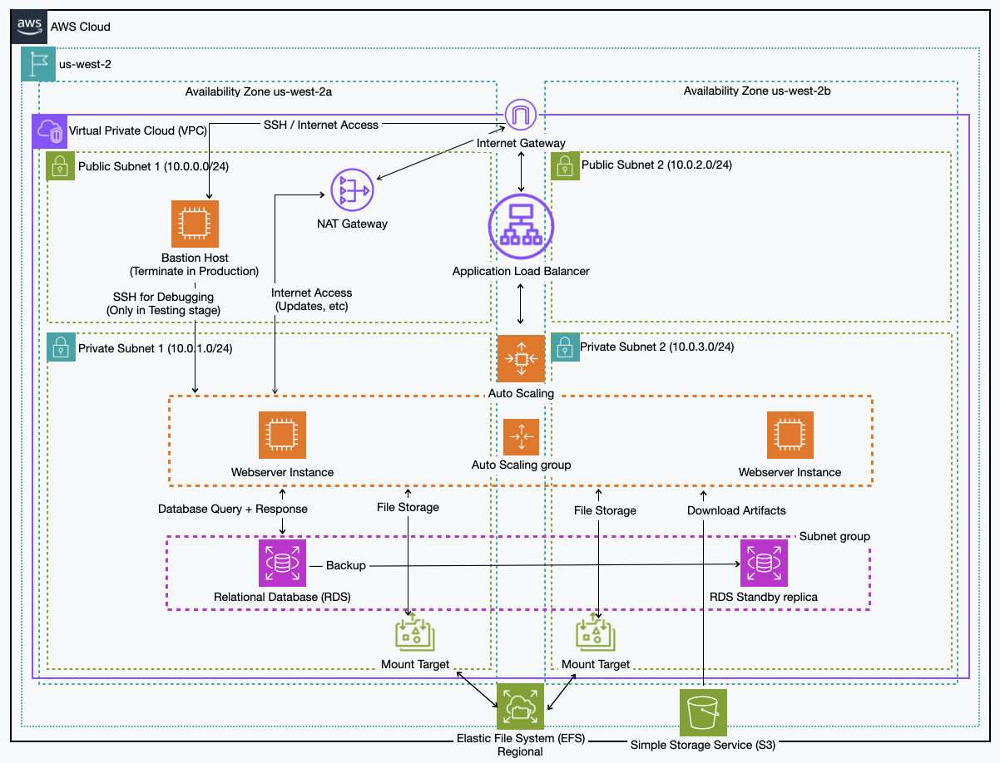

# Stateless WordPress on AWS with Terraform

This repository contains my AWS stateless WordPress capstone project from the AWS Cloud Engineer bootcamp at neue fische.  
It deploys a multi-AZ, stateless WordPress stack on AWS using Terraform.

The goal is to separate application state from the web tier, introduce basic high availability and keep everything reproducible via infrastructure as code.

---

## Architecture Overview



High-level design:

- VPC with public and private subnets across two Availability Zones
- Internet-facing Application Load Balancer in the public subnets
- Auto Scaling group of WordPress EC2 instances in the private subnets (launched via a launch template + user data)
- EFS file system for shared `wp-content`, mounted via an Access Point on all web instances
- RDS database instance in private subnets for the WordPress database
- AWS Secrets Manager for database credentials and other sensitive values
- Bastion host in a public subnet for SSH into the private network
- NAT gateway so private resources can reach the internet for updates and package installs

---

## Terraform Layout

The Terraform code is split into focused files instead of one giant `main.tf`:

```text
AWSstatelessWordpressServer/
├── main.tf                         # root module wiring and (remote) backend setup
├── providers.tf                    # Terraform + AWS provider configuration
├── vpc.tf                          # VPC, subnets, route tables, IGW / NAT basics
├── security-groups.tf              # SGs for ALB, web tier, bastion, RDS, EFS
├── loadbalancer.tf                 # Application Load Balancer, target group, listener
├── autoscaling.tf                  # launch template + Auto Scaling group for WordPress
├── scaling.tf                      # scaling policies / target tracking configuration
├── rds.tf                          # RDS instance for the WordPress database
├── efs.tf                          # EFS file system, mount targets, access point
├── secretsmanager.tf               # Secrets Manager secret(s) for DB credentials, etc.
├── bastion.tf                      # bastion host and related networking bits
├── ami.tf                          # AMI data source / lookup
├── variables.tf                    # variable definitions (VPC, DB, instance sizes, etc.)
├── outputs.tf                      # important outputs (e.g. ALB DNS name)
├── LaunchTemplateUserData.sh       # user data script for the WordPress web instances
├── bastionuserdata.sh              # user data script for the bastion host
├── AWSstatelessWordpressServer.png # architecture diagram
└── planfile                        # example Terraform plan (local artefact, optional)
```


## How to Use This Repository
This repo is mainly here as a portfolio / learning artefact.
If you want to run it yourself, you will need:
-  an AWS account
- the Terraform CLI installed locally
- configured AWS credentials (for example via aws configure or environment variables) and an SSH key pair that matches the configuration in the Terraform files.

Once that is in place:
 - Clone this repository, adjust the variables in variables.tf or in a local terraform.tfvars file to match your environment. Also set up the credentials for RDS in the AWS Secrets Manager. 
 - Then run terraform init, terraform plan and terraform apply from the project root. 
 - When the run finishes, you can use the DNS name of the Application Load Balancer from the Terraform output (or from the AWS Management Console) in a browser to reach the WordPress site, after the EC2 instances have completed their user data setup and registered as healthy targets behind the load balancer.

## Limitations & Next Steps
Current scope:
This project deploys a stateless-style WordPress setup on AWS with 
- an Application Load Balancer
- an Auto Scaling group of EC2 instances spread across multiple Availability Zones
- shared wp-content storage on EFS (for project only One-Zone)
- an RDS database running in private subnets
- a NAT gateway for outbound internet access from the private network
- a bastion host for SSH access into the VPC. 
- The security groups and the overall network layout are designed for learning and demonstration rather than as a fully hardened production environment.

Planned follow-ups include:
- Further hardening of the security groups and SSH access (for example by reducing exposed ports or using SSM Session Manager instead of direct SSH)
- a stricter HTTPS setup with AWS certificate Manager and automatic HTTP-to-HTTPS redirects on the load balancer
- improved monitoring and logging using CloudWatch metrics, logs, dashboards and alarms

For now, this repository shows a complete, reproducible AWS infrastructure for a stateless WordPress site using Terraform and a simple local CLI-based workflow.