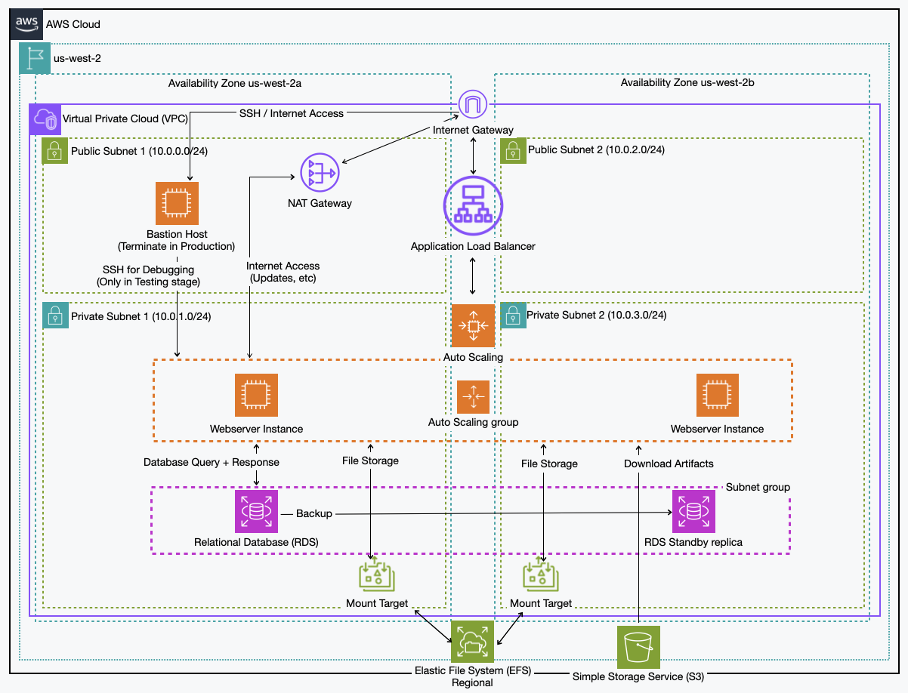

# AWS Stateless WordPress Infrastructure

A production-ready, highly available WordPress deployment on AWS using Terraform. This project demonstrates modern cloud architecture patterns with infrastructure as code, implementing a stateless web tier with shared storage and managed database services.

## 🏗️ Architecture Overview



### Key Components

- **Multi-AZ VPC** with public and private subnets across two availability zones
- **Application Load Balancer** with HTTPS and HTTP→HTTPS redirect
- **Auto Scaling Group** with EC2 instances in private subnets
- **Amazon EFS** for shared WordPress content storage
- **Amazon RDS** for managed MySQL database
- **AWS Secrets Manager** for secure credential management
- **Bastion Host** for secure SSH access
- **NAT Gateway** for outbound internet connectivity

### Design Principles

- **Stateless Web Tier**: EC2 instances store no persistent data
- **High Availability**: Multi-AZ deployment with auto-scaling
- **Security**: Private subnets, security groups, and managed credentials
- **Scalability**: Horizontal scaling based on demand
- **Infrastructure as Code**: Fully reproducible via Terraform

## 📁 Project Structure

```text
AWSstatelessWordpressServer/
├── main.tf                      # Root module configuration
├── providers.tf                 # Terraform and AWS provider setup
├── variables.tf                 # Input variables
├── outputs.tf                   # Output values
├── terraform.tfvars             # Variable values (not committed)
├── vpc.tf                       # VPC, subnets, routing
├── security-groups.tf           # Security group definitions
├── loadbalancer.tf              # Application Load Balancer with HTTPS
├── autoscaling.tf               # Launch template and ASG
├── scaling.tf                   # Auto scaling policies
├── rds.tf                       # RDS database instance
├── efs.tf                       # EFS file system and mount targets
├── secretsmanager.tf            # Secrets Manager configuration
├── bastion.tf                   # Bastion host setup
├── iam.tf                       # IAM roles and policies
├── ami.tf                       # AMI data sources
├── LaunchTemplateUserData.sh    # WordPress instance initialization
├── BastionUserdata.sh           # Bastion host setup script
└── LICENSE                      # MIT License
```

## 🚀 Quick Start

### Prerequisites

- AWS CLI configured with appropriate credentials
- Terraform >= 1.0 installed
- SSH key pair created in your target AWS region

### Required AWS Resources

Before deployment, set up these 3 resources:

1. **S3 Bucket:** `veganlian-artifacts`
   - Upload `wordpress.zip` (WordPress installation files)
   - Upload `local.sql` (database dump)

2. **Secrets Manager Secret:** `wpsecrets`
   ```bash
   aws secretsmanager create-secret \
   --name "local" \
   --description "WordPress database credentials" \
   --secret-string '{
       "db_name": "local",
       "db_user": "wpuser", 
       "db_password": "your-secure-password",
       "db_host": "will-be-updated-by-terraform"
   }'
   ```

3. **Email Address:** For SNS notifications (update in `cloudwatchSNS.tf`)

### Deployment Steps

1. **Clone the repository**
```bash
git clone <repository-url>
cd AWSstatelessWordpressServer
```

2. **Configure variables**
```bash
cp terraform.tfvars.example terraform.tfvars
# Edit terraform.tfvars with your values
```

3. **Deploy infrastructure**
```bash
terraform init
terraform plan
terraform apply
```

4. **Access your WordPress site**
   - Use the ALB DNS name from Terraform outputs
   - HTTPS will be available immediately (browser certificate warning expected)
   - HTTP automatically redirects to HTTPS

5. **Test autoscaling**
   - Test load balancing and auto-scaling via ALB:
```bash
ab -n 1000 -c 10 https://$(terraform output -raw alb_dns_name)/
```

## ⚙️ Configuration

### Required Variables

```hcl
region = "us-west-2"
vpc_cidr = "10.0.0.0/16"
public_subnets = ["10.0.1.0/24", "10.0.2.0/24"]
private_subnets = ["10.0.3.0/24", "10.0.4.0/24"]
db_secret_name = "wpsecrets"
key_name = "your-ec2-key-pair"
```

### Optional Customizations

- Instance types for web servers and database
- EFS performance mode and throughput
- Auto scaling parameters
- Security group rules
- RDS Multi-AZ (set `multi_az = true` for production)

## 🔒 Security Features

- **Network Isolation**: Web servers in private subnets
- **HTTPS Encryption**: ALB terminates SSL with default certificate
- **Encrypted Storage**: EFS and RDS encryption at rest
- **Secrets Management**: Database credentials in AWS Secrets Manager
- **Security Groups**: Least privilege access controls

## 🔧 Troubleshooting

### Common Issues

1. **HTTPS Certificate Warning**
   - Expected behavior with ALB default certificate
   - Click "Advanced" → "Proceed" in browser
   - For production, consider custom domain with ACM certificate

2. **Database Connection Failures**
   - Verify Secrets Manager configuration
   - Check security group rules
   - Ensure RDS is in available state

3. **EFS Mount Issues**
   - Confirm mount targets in correct subnets
   - Verify security group allows NFS traffic (port 2049)
   - Check EFS file system state

### Debugging Commands

```bash
# Check instance logs
aws logs describe-log-groups --log-group-name-prefix "/aws/ec2"

# View user data execution
ssh -i your-key.pem ec2-user@bastion-ip
sudo tail -f /var/log/user-data.log

# Test database connectivity
mysql -h <rds-endpoint> -u <username> -p
```

## 💰 Cost Optimization

### Current Architecture Costs (~$75-85/month):
- **Compute**: EC2 instances (t2.micro) - ~$17/month
- **Database**: RDS (db.t3.micro) - ~$15/month  
- **Networking**: ALB + NAT Gateway - ~$67/month
- **Storage**: EFS + S3 - ~$3/month

### Cost Savings Options:
- **Reserved Instances**: 30-60% savings on compute
- **Single-AZ RDS**: ~$15/month savings (reduce availability)
- **Scheduled Scaling**: Scale down during off-hours
- **Right-sizing**: Monitor and adjust instance sizes

## 🚧 Future Enhancements

### Enhanced Security & Compliance
- **AWS WAF (Web Application Firewall)** - Protect against SQL injection, XSS attacks
- **VPC Flow Logs** - Network traffic monitoring and security analysis
- **Secrets Manager rotation** - Automatic database password updates

### Performance & Scalability
- **Amazon CloudFront CDN** - Global content delivery for faster load times
- **RDS Multi-AZ deployment** - Database high availability and failover
- **ElastiCache integration** - Redis/Memcached for WordPress object caching

### DevOps & Automation
- **CI/CD Pipeline with CodePipeline** - Automated WordPress updates via S3
- **Blue/Green deployments** - Zero-downtime application updates
- **Infrastructure testing** - Automated Terraform validation and testing

### Monitoring & Operations
- **Enhanced CloudWatch dashboards** - Real-time metrics visualization
- **Centralized logging with CloudWatch Logs** - Application and infrastructure logs
- **Automated backup strategies** - Scheduled RDS and EFS backups
- **Cost monitoring and optimization** - Track and optimize AWS spending

## 📝 License

This project is licensed under the MIT License - see the [LICENSE](LICENSE) file for details.

---

**Note**: This project uses ALB default SSL certificates for HTTPS. For production deployments with custom domains, consider implementing Route53 DNS management and ACM certificates for trusted SSL.
